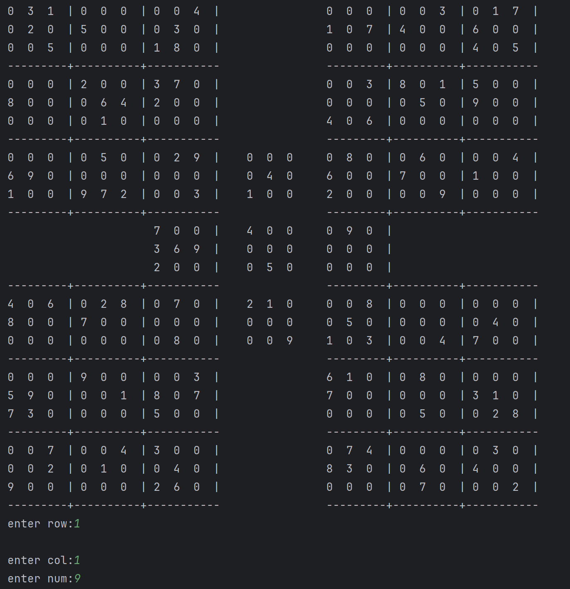
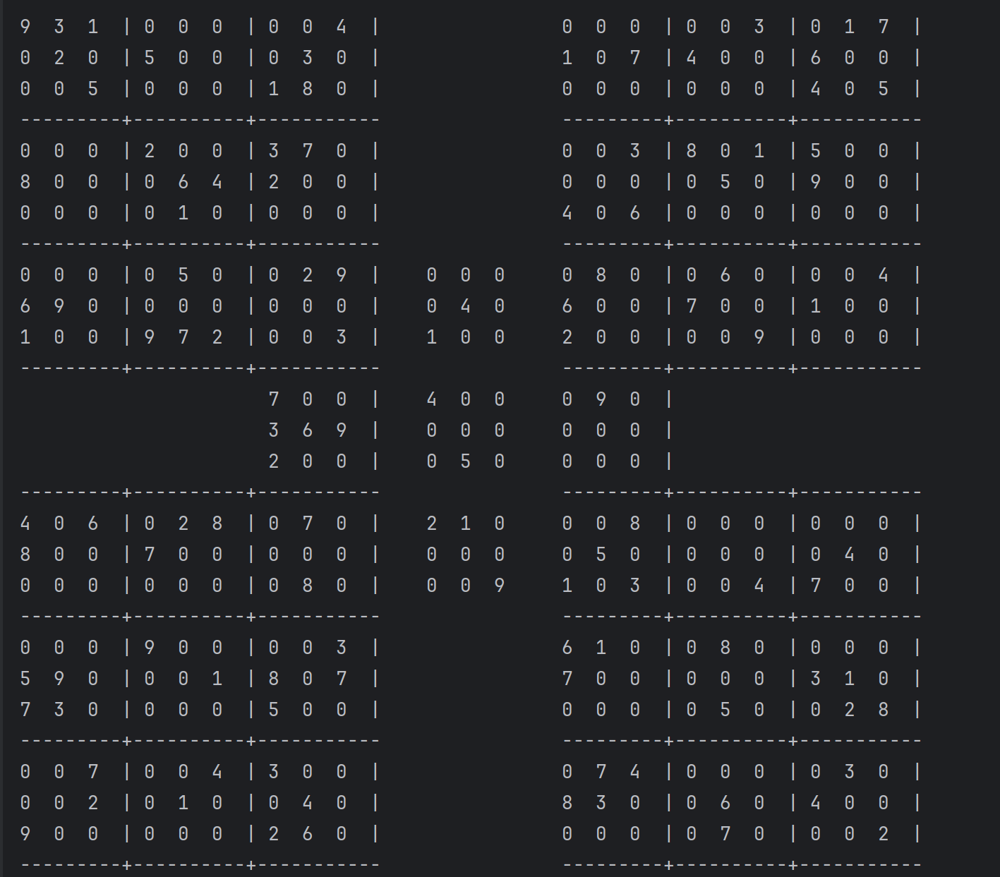
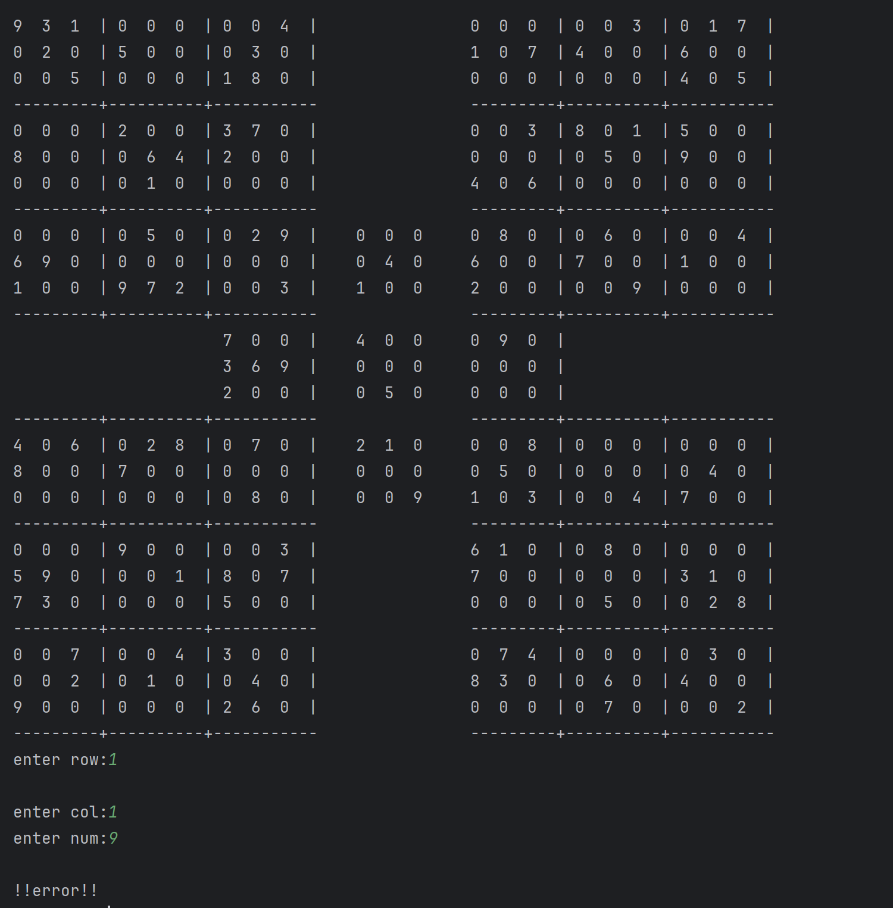

# Advanced C++ Samurai Sudoku (Multi-Grid) 🧩

A complex and advanced implementation of **Samurai Sudoku** in modern C++ using the terminal environment. Unlike standard 9x9 Sudoku, this project manages **5 interconnected 9x9 Sudoku grids** simultaneously using a custom 3D array structure.

---

## 📸 Gameplay Preview

The game dynamically renders the giant multi-grid board on the console and manages global overlapping constraints in real-time.

<p align="center">
    
  
  
</p>

---

## 🛠️ Technical Architecture & Code Structure

The game represents the entire board using a 3D matrix: `int sudoku[5][9][9]`, where:
- `sudoku[0]`: Top-Left Grid
- `sudoku[1]`: Top-Right Grid
- `sudoku[2]`: **Center Grid** (Overlaps with all other 4 grids)
- `sudoku[3]`: Bottom-Left Grid
- `sudoku[4]`: Bottom-Right Grid

### Key Core Functions Implemented:
* `initializeSudoku`: Hardcodes and sets up the starting layout and numbers for all 5 boards.
* `printSoudoko`: A robust UI drawing engine that renders the interconnected grids beautifully in the terminal with proper dividers (`|` and `---`).
* `check_Erorr`: Coordinates the globally shared zones, mapping global user coordinates (row/col) to internal grid dimensions, and tracks the **3-strike endgame condition**.
* `getRowColumnSquare`: Extracts sub-grids ($3 \times 3$ blocks), rows, and columns dynamically for validation.

---

## ✨ Features

- **Interconnected Grid Validation:** Entering a number in the overlapping areas (Rows 7-15, Cols 7-15) automatically validates against the central grid rules as well as the respective corner grid.
- **Strike System (Endgame):** Players have a maximum of 3 errors. Making 3 invalid moves triggers an automatic `endgame` state.
- **Clean Console UI:** Complete alignment and mapping of grid junctions using tab spacing and borders.

---

## 🚀 How to Compile and Run

### Prerequisites
A compiler that supports C++11 or higher (GCC, Clang, or MSVC).

### Step-by-Step Compilation

1. Clone the repository:
   ```bash
   git clone [https://github.com/amiralitw9/PacMan.git](https://github.com/amiralitw9/PacMan.git)
